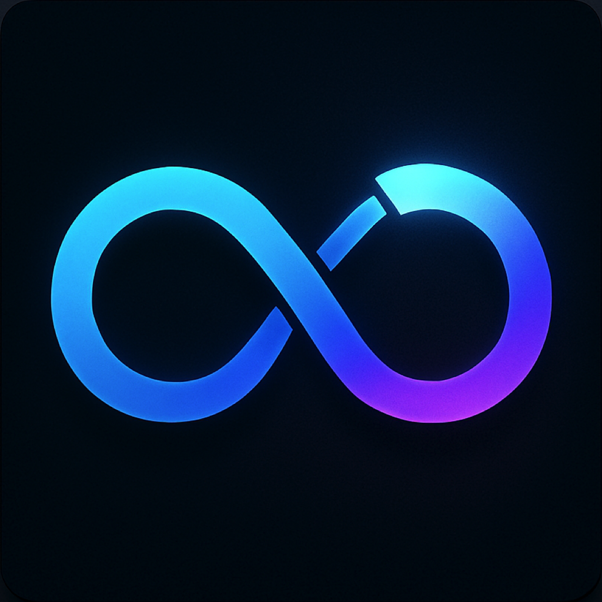

# SuperChargedLoop

A relaxing, visually pleasing tile puzzle game for iOS, inspired by classic loop and connection games. Rotate tiles to connect paths, enjoy pastel color themes, and customize your experience with interactive settings.

---

## ✨ Features

- **Interactive Tile Grid:** Tap and rotate tiles to solve the loop puzzle.
- **Dynamic Generation:** Each level is procedurally generated for endless variety.
- **Beautiful Pastel Themes:** Enjoy a soothing color palette that changes with every level.
- **Customizable Density:** Choose between Normal, Dense, or Scrolling grid sizes.
- **Haptic Feedback:** Optional tactile feedback for a satisfying experience.
- **One-Tap Regeneration:** Instantly generate a new puzzle by tapping the background (optional).
- **Responsive UI:** Smooth animations and adaptive layout for all iOS devices.